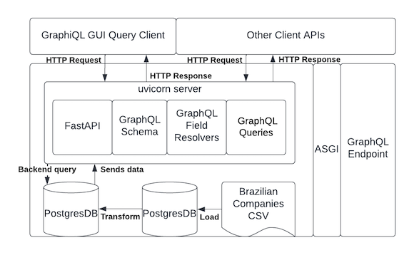

# Brazilian Business Partner API #

## What is this?

An app for a clients hack-a-thon to show how we can use GraphQL to acces their data. This app is for users to find Brazilian companies that are related to each other via an API service. The API is on top of a data set which has about 9 million Brazilian companies listed. Each row in the data has a company and an operator, and that operator might be in another row with another company. So companies can have relationships via these operators. Operators can be an individual, or they can be a person. The companies and the operators form a graph where the companies are the vertices and the operators are the edges. One of the goals is to create a graph such that a company can be followed along the shared operators to find all the connected companies. From a user perspective, the goal of the API service is to allow a user to query the data via an API call and get three things:

- All operators associated with a given company.
- All companies associated with a given operator.
- All companies connected to a given company via shared operators.

Secondly, there is a CLI application that loads the data from the CSV file to a database, and transforms the data into a more digestible data model. 



## How to build

### **Pre-reqs** 

1. Docker installed
2. Python installed
3. pyenv installed
4. pyenv-virtualenv installed 
5. Access to the internet to get the postgres image.

### **Follow the steps** 

```shell script
gh repo clone fartzy/brazilian-business-partner-api

cd brazilian-business-partner-api

pyenv virtualenv brazilian-business-partner-api-env

pyenv activate brazilian-business-partner-api-env

pip install -r requirements.txt

cd dockerdb

. ./run.sh

pip install -e .
```


## Commands ##

**There are two commands of the application:**

* `dataload`
* `api`


### `dataload` command ### 

| Short Option | Long Option | Type | Description |
|------------- | ----------- | -----|-----------  |
| -fp | --csv-file-path | TEXT | This option can be given to set the location of the raw CSV file of Brazilian companies. [required]|
| -fl | --forced-load | TEXT | You need to do this the first time. After that, only do this if you really want to. |
| -c | --config-path | PATH | This option is the path of the config file, which is needed for database connectivity. There is a default in `brazilian_business_partner/config/config.toml`[required]|
| -s | --sample-size | INTEGER | Will determine the amount of records if you want to do a 'sample migration'. This is helpfule the check if the utility works. *Not implemented* |
| -ll | --log-level | TEXT | Determins the level of logging. Valid levels are: CRITICAL, ERROR, WARNING, INFO, DEBUG, NOTSET |
| -lp | --log-path | TEXT | This otpion is the whole absolute path of the the log file. It is not checked for existence. |

----------------------------------------------------------------------------------------------------------------------------------------

### `api` command ### 

| Short Option | Long Option | Type | Description |
|------------- | ----------- | -----|-----------  |
| -c | --config-path | PATH | This option is the path of the config file, which is needed for database connectivity. There is a default in `brazilian_business_partner/config/config.toml`[required]|
| -ll | --log-level | TEXT | Determins the level of logging. Valid levels are: CRITICAL, ERROR, WARNING, INFO, DEBUG, NOTSET |
| -lp | --log-path | TEXT | This otpion is the whole absolute path of the the log file. It is not checked for existence. |

----------------------------------------------------------------------------------------------------------------------------------------

To execute a full dataload...
```shell 
braz-bpa-cli dataload  \
      -c /Users/mikeartz/brazilian-business-partner-api/brazilian_business_partner_api/config/config.toml \
      -fp /Users/mikeartz/brazilian-business-partner-api/data/ReceitaFederal_QuadroSocietario.csv \
      -fl 
      -ll DEBUG
```
To run the api service...
```shell 
braz-bpa-cli api \
      -c /Users/mikeartz/brazilian-business-partner-api/brazilian_business_partner_api/config/config.toml
```

### Navigate to the GraphQL endpoint with your browser to use GraphiGL browser based client. ### 

```shell script
http://127.0.0.1:8000/graphql
```

- There are 2 fields in the GraphQL schema -
    1. Company (nr_cnpj)
        1. Find all the operators connected to a company.
        2. Find all the companies sharing an operator with a company.   
    2. Operator 
        1. Find all the companies connected to an operator

## A Little About the Data

https://datasebrae.com.br/totaldeempresas/

https://en.wikipedia.org/wiki/CNPJ
